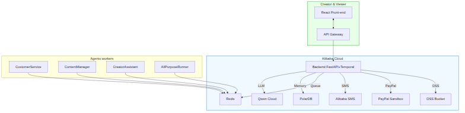

# peaceofmind

**Agent Society – Multi‑Agent Collaboration Platform**

_An open‑source intelligent assistant for content creators that combines a customer‑service bot, a content‑manager, a daily creator assistant, and a generic runner for external services. Powered by Qwen Cloud (DashScope) and deployed on Kubernetes._

---

## Project Overview

- **Primary track:** **Agent Society**
- **Programming language:** Python (FastAPI) and React.
- **LLM:** Qwen Cloud via DashScope SDK (function‑calling mode) powers all agents.
- **External integrations:**
  - **Alibaba Cloud SMS** (proof of Alibaba Cloud usage).
  - **PayPal Sandbox** (payment verification).
- **Persistence:** PostgreSQL + Redis.
- **Deployment:** Kubernetes manifests in `deploy/k8s/`. Docker images built for backend and frontend with Nginx reverse proxy for API routing.
- **Orchestration:** Agent dispatch via shared Qwen client.

---

## Architecture Diagram



A Mermaid source (`docs/architecture.mmd`) is also included for reference.

---

## Quick‑Start (Local Development)

> **Prerequisites**
> - Docker installed.
> - Python 3.11+, Node 20+.
> - Access to a Kubernetes cluster (e.g., k3s, minikube, or Docker Desktop).
> - DashScope API key (`kubectl create secret generic backend-env --from-env-file=backend/.env -n peaceofmind`).

1. **Clone the repository**
   ```bash
   git clone https://github.com/whoshotu/peaceofmind.git
   cd peaceofmind
   ```

2. **Build Docker images**
   ```bash
   docker build -t peaceofmind-backend:local backend
   docker build -t peaceofmind-frontend:local frontend
   ```

3. **Deploy to Kubernetes**
   ```bash
   kubectl apply -f deploy/k8s/
   ```

4. **Access the UI**
   ```bash
   kubectl port-forward -n peaceofmind service/frontend 18080:80
   ```
   Open `http://localhost:18080`. The frontend proxies `/api/` requests to the backend service inside the cluster.

5. **Check backend health**
   ```bash
   kubectl port-forward -n peaceofmind service/backend 18000:8000
   curl http://localhost:18000/health/ready

---

## Testing the End‑to‑End Flow

1. Open the UI and type a viewer question, e.g., *"I paid for the premium video but can't see it"*.
2. The **CustomerServiceAgent** will call Qwen Cloud, detect low confidence, and create a pending task.
3. In the *Admin* panel, click **Approve** – the workflow proceeds.
4. The **AllPurposeRunnerAgent** verifies the PayPal order (sandbox) and, on success, triggers the **SMSAdapter** which sends an SMS and writes a tiny log file to the OSS bucket.
5. The final response is displayed in the chat window.

You can also test the **ContentManagerAgent** by typing *"Schedule my draft for tomorrow 10 am"* and observe the OSS upload and calendar entry creation.

---

## Agents Overview

| Agent | Responsibility |
|-------|-----------------|
| **CustomerServiceAgent** | Answers viewer questions, flags ambiguous inputs, routes to Human‑In‑The‑Loop when needed. |
| **ContentManagerAgent** | Organizes drafts, adds tags, schedules posts, moves assets in OSS. |
| **CreatorAssistantAgent** | Daily reminders, calendar sync, suggests next content ideas based on stored preferences. |
| **AllPurposeRunnerAgent** | Executes external actions – PayPal verification, Alibaba Cloud SMS, OSS uploads – on behalf of the other agents. |
| **NegotiationMediatorAgent** *(optional)* | Resolves conflicts when multiple agents propose competing actions. |
| **MemoryCleanerAgent** *(background)* | Periodically removes stale entries from the PolarDB memory store. |
| **HumanInTheLoopAgent** | Presents ambiguous tasks to a human reviewer via the admin UI and records the decision. |
| **AnalyticsReporterAgent** *(optional)* | Generates daily/weekly summary reports on tickets, payments, SMS, and agent efficiency. |

---

## Deployment Proof

The Kubernetes manifests in `deploy/k8s/` are the primary deployment method. After applying, verify:

```bash
kubectl get pods -n peaceofmind
kubectl get svc -n peaceofmind
```

The backend `/health/ready` endpoint confirms the service is operational.

---


## License

This project is licensed under the **MIT License** – see the `LICENSE` file.

---

## Contact & Contributions

- **Author:** _whoshotu_ (GitHub: [whoshotu](https://github.com/whoshotu))
- Feel free to open issues or pull requests. Contributions are welcome!
